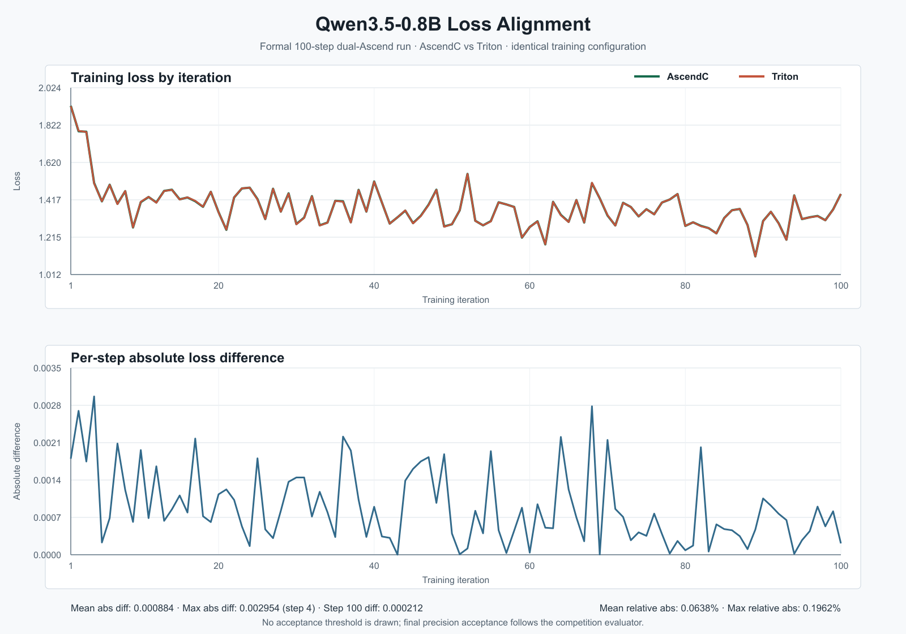

# AscendPilot-Bio

面向昇腾环境的 Qwen3.5 训练迁移与科研场景验证项目。官方主线是将 Qwen3.5-0.8B 迁移至 MindSpeed-MM/FSDP，在双昇腾 910 上完成 AscendC 与 Triton 同条件训练、loss 对齐、性能比较和 Checkpoint 保存。Qwen3.5-4B Agent 与 riceFM 公开水稻单细胞分析作为扩展验证，不替代官方训练任务。

## 核心成果

- 完成 AscendC、Triton 两组双芯片 100-step 正式训练，均保存第 100 step Checkpoint。
- 完成逐 step loss 对齐：平均绝对差 0.000884，最大差 0.002954，第 100 step 差 0.000212。
- 完成 DCP CPU/Gloo process group 兼容补丁，并提交 MindSpeed-MM PR。
- 提供可复用的训练迁移 Skill、公开数据离线 Demo 和 Ascend 真机演示系统。
- riceFM 在 `npu:1` 使用公开 `GSE232863` 的 25 基因锚点子集生成 256 维 embedding；Qwen3.5-4B 在 `npu:0` 生成带证据引用的分析报告。

## 环境版本

- 操作系统：openEuler 24.03 ARM64
- 硬件：2 x Ascend 910，单卡 64 GB HBM
- CANN：9.1.0-beta.3
- Python：3.12.13（`/usr/local/python3.12.13/bin/python3`）
- PyTorch：2.7.1
- torch_npu：2.7.1.post10
- Qwen：Qwen3.5-4B，运行于 `npu:0`
- riceFM：用户 checkpoint，运行于 `npu:1`

## 最小可运行 Demo

普通 Windows、Linux 或 macOS 电脑只需 Python 3，无需 NPU、模型权重或第三方 Python 包。

Windows：

```powershell
powershell -ExecutionPolicy Bypass -File deliverables\run_offline_demo.ps1
```

Linux/macOS：

```bash
bash deliverables/run_offline_demo.sh
```

浏览器访问 `http://127.0.0.1:8890/demo`。该模式展示 `E-ENAD-52/GSE146035` 的公开 UMAP、28 个无监督 cluster 和 marker 证据，并明确标注未执行 Qwen、riceFM 或 Ascend NPU 实时推理。

## 官方训练运行

官方训练主线：

```bash
bash deliverables/qwen35-mindspeed-training/scripts/run_training.sh \
  examples/qwen3_5/qwen3_5_0.8B_config.yaml logs/ascendc
python deliverables/scripts/compare_training_logs.py \
  --ascendc logs/ascendc/train.log --triton logs/triton/train.log \
  --start 1 --end 100 --output results/training-log-comparison.json
```

AscendC 与 Triton 两次运行除算子实现外必须保持数据、随机种子、batch size、步数和训练超参数一致。

## Ascend 真机演示

目标机服务由 supervisor 管理，启动入口为 `/opt/start_qwen35.sh`，服务监听 `127.0.0.1:8000`，并启用 API Token、日志轮转、自动重启和 `/version`。

```bash
ssh -N -L 8000:127.0.0.1:8000 \
  -J 'JUMP_USER:JUMP_TOKEN@JUMP_HOST:JUMP_PORT' root@TARGET_HOST
```

浏览器通过 SSH 本地端口转发访问 `http://127.0.0.1:8000/demo`。服务为本机页面签发短期 HttpOnly 演示会话，无需在网页中填写或保存长期 Token。页面之外的受保护 API 仍需 `x-api-key` 或 Bearer Token。

服务器可运行 `deliverables/deployment/deploy_and_verify.sh` 切换到公开真机模式。该模式以 `E-ENAD-52` 驱动 UMAP、cluster 和 marker 证据，Qwen3.5-4B 在 Ascend `npu:0` 实时生成报告；riceFM 使用公开 `GSE232863/GSM8865415` 的 25 基因验证锚点子集，在 `npu:1` 实时生成 256 维 embedding。该 pilot 不是全转录组映射，也没有经过验证的细胞类型分类头，因此页面不会把 embedding 说成细胞类型预测。

## 代码结构说明

- `deliverables/qwen35-ascend-migration/`：环境检查、候选精度实测、部署策略选择、迁移验证和报告 Schema。
- `deliverables/qwen35-mindspeed-training/`：官方赛题主 Skill，包含双卡训练启动和 AscendC/Triton 日志对齐。
- `deliverables/plantcell-skill/`：标准 Skill、API 文档、JSON Schema、安装/启停/状态/健康检查/演示脚本。
- `deliverables/public-rice-root-skill/`：无需私有数据和模型权重即可运行的公开根尖 cluster/marker 证据 Skill。
- `deliverables/public_data/`：公开 `E-ENAD-52` 审查子集，以及 `GSE232863` 的 riceFM 25 基因锚点输入、来源和哈希。
- `deliverables/skill/`：Qwen Agent 与 riceFM 适配器实现。
- `deliverables/deployment/`：Qwen 服务端、部署脚本和性能升级脚本。
- `deliverables/scripts/`：训练日志比较、精度对齐制图、性能压测、Agent 验收和环境检查脚本。
- `deliverables/demo/`：无额外前端依赖的评审演示页。
- `deliverables/results/`：训练日志、对比 JSON、环境记录、公开 riceFM pilot 结果和精度对齐图。

## 代码逻辑

自然语言问题先进入 Qwen JSON Planner，计划经格式检查后只能调用 `public_atlas_evidence` 和 `qwen_report` 白名单工具；计划无效时采用确定性兜底方案。Evidence Store 汇总计划、公开数据、marker 证据和执行边界，Verifier 检查证据编号及无依据内容，必要时触发一次自动修正。riceFM embedding 由独立接口执行，不被表述为细胞类型预测。

## 官方训练实测结果

双芯片正式 A/B 两份日志各完成 100 step，global batch size 均为 8。按 step 1-100 同口径统计：AscendC 2.716775 samples/s，Triton 2.341653 samples/s，AscendC 全流程吞吐提升 16.02%；逐 step loss 平均绝对差 0.000884，最大 0.002954，第 100 step 差 0.000212。step 11-100 稳态窗口中 AscendC 为 4.036069 samples/s、Triton 为 6.898838 samples/s，AscendC 低 41.50%，因此不能把全流程收益外推为普遍加速。最终精度通过标准以赛事验收脚本为准。



## 扩展场景实测结果

公开 riceFM 兼容性测试使用 64 个真实细胞和 25 个经核验的基因锚点，在 Ascend `npu:1` 生成 `[64, 256]` embedding；全部输出为有限值，平均 L2 范数为 14.9021，模型加载后的批量推理吞吐为 172.37 cells/s。由于 checkpoint 没有面向该公开数据集的分类头，本测试不计算 Accuracy、Macro-F1 或 Weighted-F1。

已保存的 Qwen FP32/FP16 对照显示，FP16 峰值分配显存由 16.91 GB 降至 8.60 GB，下降 49.14%；加载时间下降 43.83%，但短文本吞吐下降 11.77%。因此 FP16 的主要收益是降低显存占用并支持双模型驻留，而非生成加速。

## 数据说明

面向评委的可运行审查系统已改用公开水稻单细胞数据。`E-ENAD-52` / `GSE146035` 提供 UMAP、cluster 和 marker 证据；`GSE232863` / `GSM8865415` 提供 17,133 个细胞的公开表达矩阵，其中 64 个真实细胞和 25 个经 riceFM 官方教程与 Oryzabase 交叉核验的基因锚点随仓库提供。Atlas cluster 编号不是人工校订的生物学细胞类型，riceFM pilot embedding 也不是细胞类型预测。

公开提交不包含私有 ZH11 原始表达矩阵、逐细胞结果、模型权重或 Checkpoint 分片。公开 riceFM 结果仅为 25 基因锚点兼容性 pilot，不代表全转录组适配、独立生物学验证或细胞类型分类能力。

## 演示与报告

- 最小可运行 Demo：`deliverables/run_offline_demo.ps1` 或 `deliverables/run_offline_demo.sh`
- 5 分钟演示流程：`deliverables/DEMO_GUIDE.md`
- 演示系统上交说明：`deliverables/DEMO_SUBMISSION.md`
- 精度分析报告：`deliverables/accuracy_report.md`
- 性能分析报告：`deliverables/performance_analysis_report.md`

## PR 链接

- 项目仓库：<https://github.com/first00001/ascendpilot-bio>
- MindSpeed-MM PR：<https://github.com/Ascend/MindSpeed-MM/pull/8>
- PR 分支：`first00001:qwen35-08b-ascendc-gloo`
